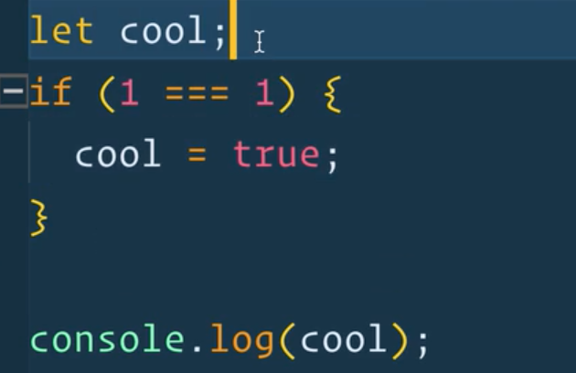

## Scope

### Global Variables

When you create a variable in a file that is not enclosed in a `function`, module or `if` statement, it is a `global variable`.
It can be accessed from any other JavaScript that is running on the page, like a `<script>` tag. Or in the console. In the browswer, `global scope` is the `window`.

`var` variables are attached to the `window` object and are global scoped.

`const` and `let` variables declared outside of a code block are also globally scoped but they are not attached.

Making `global variables` is _discouraged_. Is a recipe for a headache in almost all use cases. 

### Scope in general
#### Function Scope
Variables created inside of a function are only available inside that function (unless we explicity `return` it and put it into its own variable inside the function). {} are fences that keep the variables in and do not allow them to leak out. They can _leak in_ though. So you can use a global variables inside a function. 

###### [Eloquent JavaScript Chapter 3: Functions (excerpt)][2]
>>Bindings declared with let and const are in fact local to the block that they are declared in, so if you create one of those inside of a loop, the code before and after the loop cannot “see” it. In pre-2015 JavaScript, only functions created new scopes, so old-style bindings, created with the var keyword, are visible throughout the whole function that they appear in—or throughout the global scope, if they are not in a function.

Shadow variables: You can name variable the same thing if they are not in the same scope, however it is not a good idea as it often leads to uncertain results. 

###### [StackOverflow on Variable Shadowing in JavaScript][1]
>>In computer programming, variable shadowing occurs when a variable declared within a certain scope (decision block, method, or inner class) has the same name as a variable declared in an outer scope. This outer variable is said to be shadowed...

#### Block Scope

`{ }` = Code block. Gates that keep variables inside. They are not allowed to leave those gates. 

If you need a variable to be available outside of a block, declare the above the code block and then define it (set it to something) inside the code block. 

[1]: https://stackoverflow.com/questions/11901427/an-example-of-variable-shadowing-in-javascript
[2]: https://eloquentjavascript.net/03_functions.html